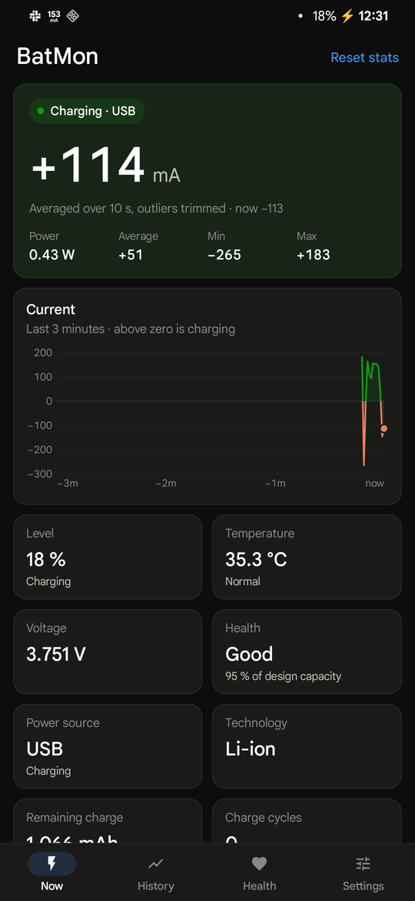
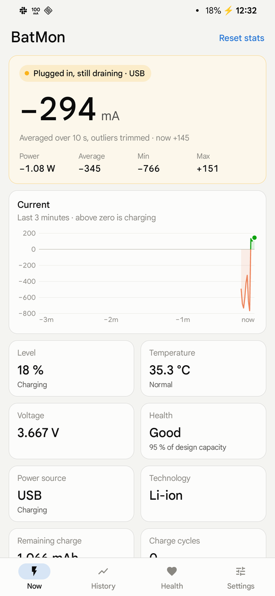
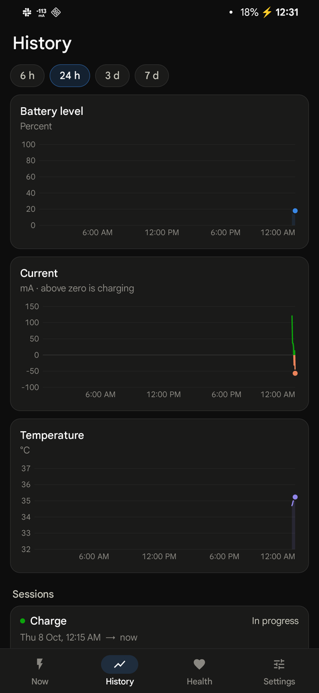
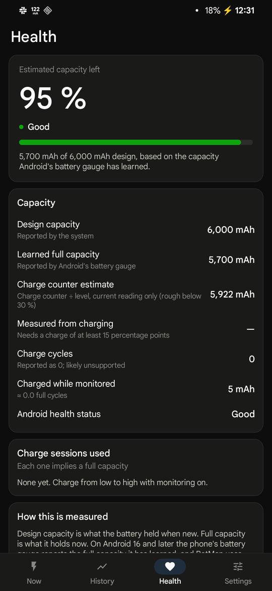
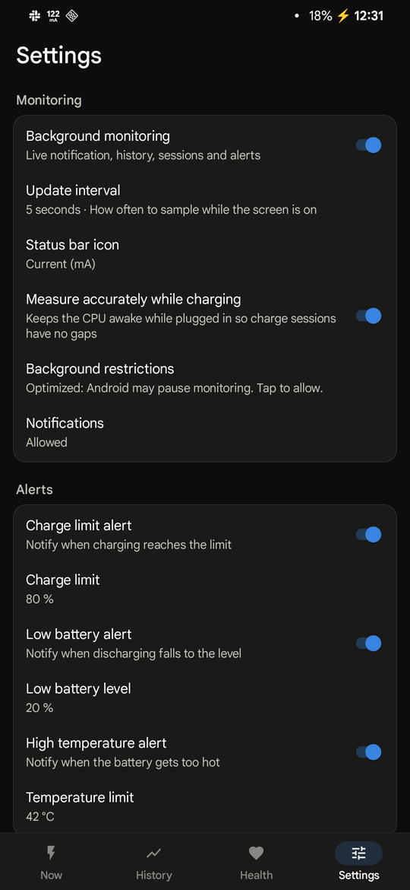

# BatMon

BatMon is a battery monitor for Android. It shows how much current flows into or out of your battery,
estimates how much capacity the battery has lost, and keeps a history of charge and discharge
sessions. It doesn't need internet access, has no ads and no trackers, and keeps all its data on the
phone.

<p>
  
  
  
  
  
</p>

## Features

- **Live current.** Charging current shows as positive and discharging current as negative, in mA,
  averaged with outliers trimmed. The screen also shows power in watts, min/avg/max since you plugged
  in or unplugged, and a 3-minute chart you can drag across to read exact values.
  - A banner warns when the phone is plugged in but still draining, for example a weak USB port with
    the screen on.
- **Every battery value.** Level, temperature, voltage, health, power source, technology, remaining
  charge, cycle count (where the phone reports it), full capacity, and time to full or empty.
- **Battery health.** BatMon compares the battery's full capacity now with its design capacity. It uses
  the first of these sources available:
  1. On Android 16 and later, the full capacity the phone's battery gauge has learned.
  2. Capacity measured by adding up the current that flows in during your own charges.
  3. Remaining charge ÷ battery level.
- **History.** Charts of battery level, current and temperature over 6 hours to 7 days, plus a list of
  charge and discharge sessions. Discharge sessions show average drain with the screen on and with it off.
- **Live notification.** A status-bar icon shows the current in mA, the battery level, or the
  temperature. The notification shows current, power, level, temperature and voltage.
- **Alerts.** A charge-limit alert (80 % by default) helps you avoid long stretches at 100 %. There are
  also low-battery and high-temperature alerts.
- **Light and dark themes** follow the system setting.

## Install

1. Download `BatMon-<version>.apk` from the [latest release](https://github.com/RakinRkz/batmon/releases/latest).
2. Optionally, check it before installing. Its SHA-256 is in the `.sha256` file next to it. Every
   release is signed with the same key, whose certificate SHA-256 digest is:
   `2d036fd6476bfa888a289220f4f254ad9dc8b8106799c977cf14c2df161c3c93`
   To check both, run `sha256sum BatMon-*.apk` and `apksigner verify --print-certs BatMon-*.apk`.
3. Open the APK on your phone and allow installs from that source when Android asks.

BatMon needs Android 8.0 or later. For uninterrupted history, open **Settings → Background
restrictions** in the app and allow unrestricted battery use.

## Accuracy

BatMon reads what Android reports. That data differs between phones:

- **Units and sign.** Most phones report current in µA, but some report mA, and a few flip the sign.
  BatMon works out both from its own readings. You can pin either one in **Settings → Display &
  measurement**.
- **Update rate.** Some phones refresh the current every second, others every few seconds, and a few
  never report it.
- **Cycle count and learned capacity.** Not every phone reports them. Where they're missing, BatMon
  falls back to its own estimates. BatMon's measured capacity sharpens after you charge in one go from
  low to high, for example from below 40 % to above 80 %, with monitoring on.

**Settings → Raw battery values** shows everything your phone reports. Please include it when you
report a reading that looks wrong.

## Permissions

| Permission | Why |
|---|---|
| Notifications | The live notification and alerts |
| Foreground service (special use) | Keeps monitoring running in the background |
| Run at startup | Restarts monitoring after a reboot or an update |
| Prevent phone from sleeping | Only while charging, and only if "Measure accurately while charging" is on |
| Ask to ignore battery optimizations | Lets you exempt BatMon from background limits |

BatMon has no internet permission.

## Build from source

BatMon is plain Java on Android framework APIs, built without Gradle using `aapt2`, `javac`, `d8` and
`apksigner`.

```sh
scripts/setup-toolchain.sh   # one-time setup, Linux x86_64: JDK 17 + Android SDK platform 35, about 1 GB
./build.sh                   # → build/BatMon.apk, signed with a local debug key
./build.sh run               # build, install over adb and launch
```

`scripts/setup-toolchain.sh` downloads the JDK from Adoptium and the SDK from Google. It accepts the
Android SDK license for you.

For a release build, run `KEYSTORE=… KS_PASS=… ./build.sh release`. It writes
`build/BatMon-<version>.apk` and its `.sha256`. [CLAUDE.md](CLAUDE.md) explains how the code is
organized.

## Contributing

Bug reports and pull requests are welcome. For a wrong reading, include your phone model, Android
version and the raw battery values (see [Accuracy](#accuracy)).

## License

BatMon is free software under the [GNU General Public License v3.0](LICENSE). The design was inspired
by Ampere. BatMon is not affiliated with Ampere or its developers.
